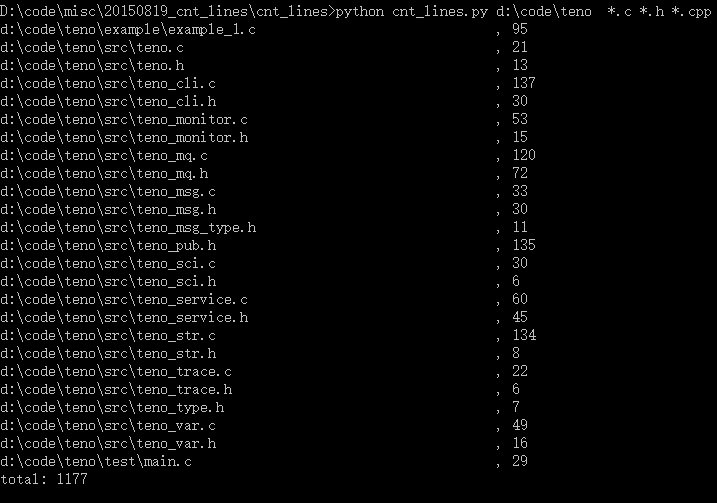

# cnt_lines
Count file lines in python.

## Overview
cnt_lines is a tool for count file lines  with a focus on easily usage.

## Usage
Start with

    python cnt_lines.py [some_dir] [wildcard_suffix]

some_dir:directory you want to count lines.
wildcard_suffix:dot suffix files you want to count lines, e.g. *.c *.h *.cpp.

## Screenshot
   

_terry3 (tfguo369@gmail.com)
